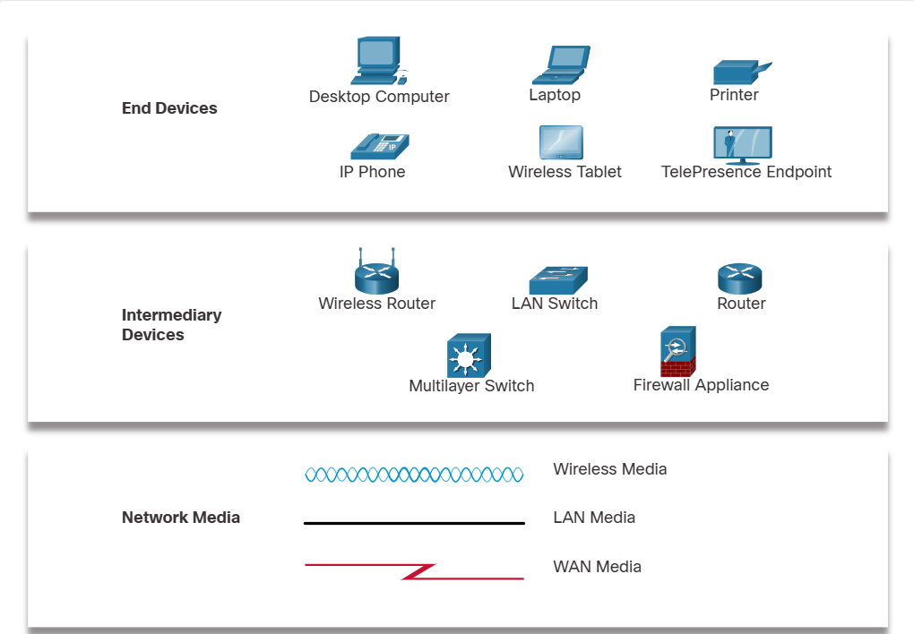

# Networking Basics 

This repository contains my learning from the networking basics Course from cisco.

---

## Table of Contents

- [Basics](#basics-)
- [Wireless-Networks](#wireless-networks-)

---
# Basics :
## Who Owns “The Internet”?

Internet is not owned by anybody but its connection of the all the interconnected networks , they are connected by optical-fibre cables , telephone wires , wireless transmissions and sattelite links.
everything you access online is stored somewhere on the internet.

## Types of Personal Data :

1. **Volunteered Data :** Data shared by the person itself by creating a social media profile or uploading online somewhere
2. **Observed Data :** the data captured by recording actions of individuals such as location data 
3. **Inferred Data :** The data taken by analysis of volunteered and observed data

## Signal Transmission :

1. **Electric Signals :** transmission is throuh electric pulses used in copper wires
2. **optical signal :** transmission is through light pulses used in optical fibres
3. **wireless signal :** transmission is through infrared ,microwave , radio waves through air

## Bandwidth and Throughput :

Bandwidth : it is the rate at which the data is transferred through a medium.
- Kbps :Thousands of Bits Per second
- Mbps :Millions of Bits Per second
- Gbps : billions of Bits Per second. 
Throughput : it is same as bandwidth but it is also influenced by amount of data and latency 
latency is amount of time ,including delays

## P2P network :

Peer to Peer network is when computers are both client and host and share different things with each other

## Cisco Packet Tracer Symbols

## ISP (Internet Service Provider) :

Internet Service provider links networks with the internet , ISPs are connected with each other to form the internet , They use Fiber-optic cables

---
# Wireless Networks :

1. **Gps :** gps or global positioning system uses satellites to find our position
2. **Wi-Fi :** Wi-Fi is used to connect to the internet with help of routers or hotspots
3. **Bluetooth :** Bluetooth is a low power and short range wireless technology normally used for speakers ,headsets ,mics . it can be used to exchange data and communicate for short distances .Multiple devices can be connected at a time.
When bluetooth is in discoverable mode it sends this data when another bluetooth device requests :
- Name
- Bluetooth class
- Services device can use
- technical info ,such as features or BT specs.
4. **NFC :** Near-field communication is very short range wireless technology used for payments .it uses elctromagnetic fields to transmit data

## Wireless Standards :

The **IEE 802.11** standard gives rules for wlan environments
- wireless stands use 2.4Ghz and 5Ghz frequency bands

## wireless Settings :

- **Network Mode :** like 802.11ac,802.11b or mixed mode
- **Network Name (SSID) :** (service set identifier ) names of the wifi like home etc
- **Standard channel :** channels are specific frequency ranges , set to auto
- **SSID Broadcast :** to show our wifi name to devices in range
