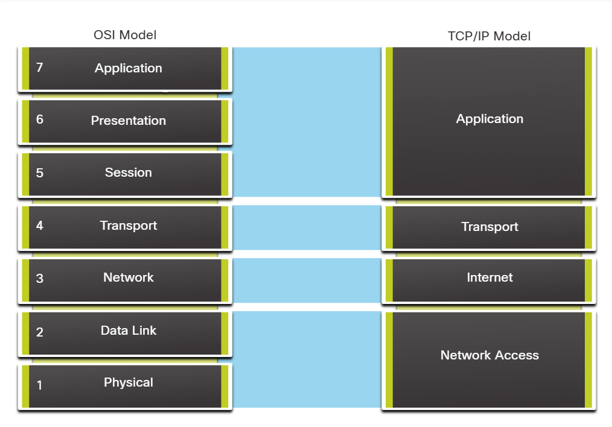
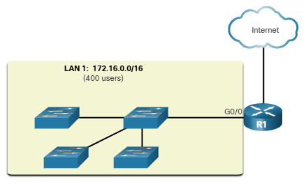
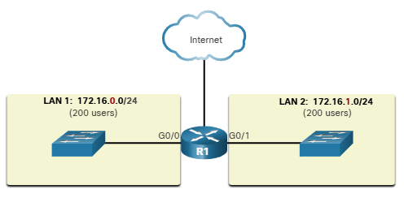
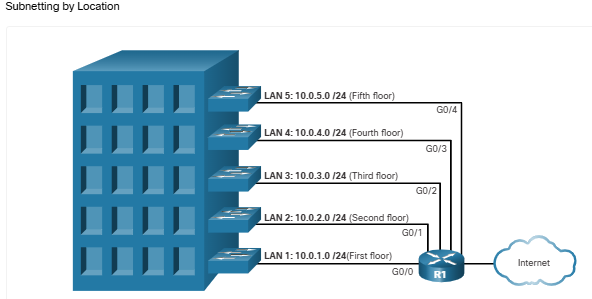
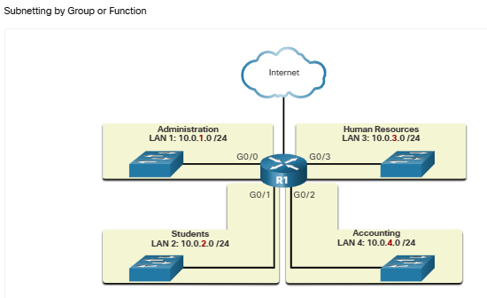
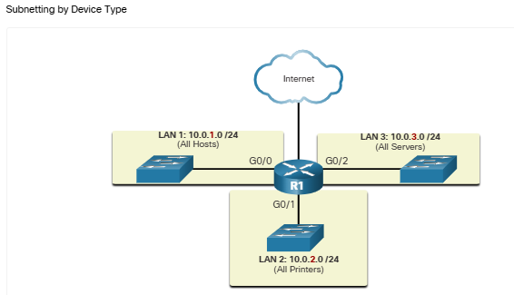
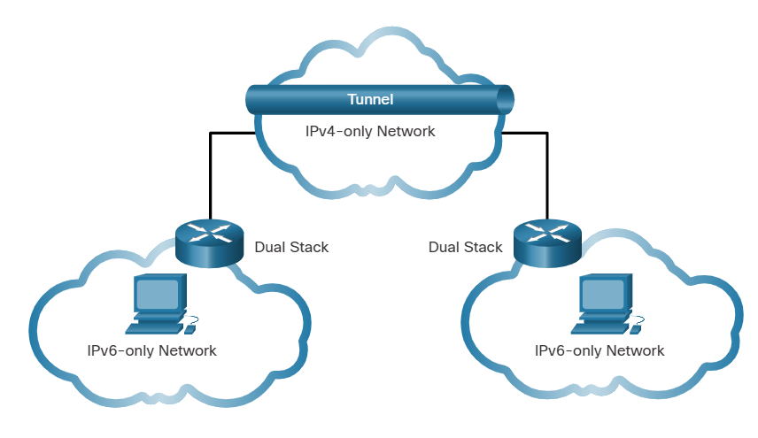
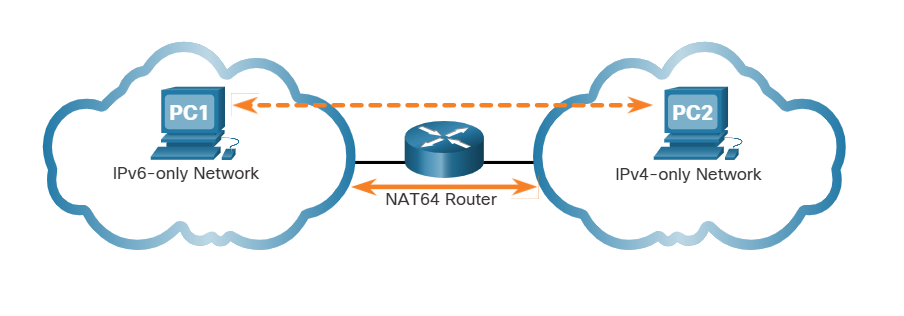

# Networking Basics 

This repository contains my learning from the networking basics Course from cisco.

---

# Table of Contents

- [Basics](#basics-)
- [Wireless Networks](#wireless-networks-)
- [TCP/IP And OSI Model](#tcpip-and-osi-model-)
- [Ethernet Switches](#ethernet-switches)
- [IPv4 And IPv6](#ipv4-and-ipv6)

---
# Basics :
## Who Owns “The Internet”?

Internet is not owned by anybody but its connection of the all the interconnected networks , they are connected by optical-fibre cables , telephone wires , wireless transmissions and sattelite links.
everything you access online is stored somewhere on the internet.

## Types of Personal Data :

1. **Volunteered Data :** Data shared by the person itself by creating a social media profile or uploading online somewhere
2. **Observed Data :** the data captured by recording actions of individuals such as location data 
3. **Inferred Data :** The data taken by analysis of volunteered and observed data

## Signal Transmission :

1. **Electric Signals :** transmission is throuh electric pulses used in copper wires
2. **optical signal :** transmission is through light pulses used in optical fibres
3. **wireless signal :** transmission is through infrared ,microwave , radio waves through air

## Bandwidth and Throughput :

1. **Bandwidth :** it is the rate at which the data is transferred through a medium.
- Kbps :Thousands of Bits Per second
- Mbps :Millions of Bits Per second
- Gbps : billions of Bits Per second
2. **Throughput :** it is same as bandwidth but it is also influenced by amount of data and latency 
`latency is amount of time ,including delays`

## P2P network :

Peer to Peer network is when computers are both client and host and share different things with each other

## Cisco Packet Tracer Symbols


## ISP (Internet Service Provider) :

Internet Service provider links networks with the internet , ISPs are connected with each other to form the internet , They use Fiber-optic cables

---

# Wireless Networks :

1. **Gps :** gps or global positioning system uses satellites to find our position
2. **Wi-Fi :** Wi-Fi is used to connect to the internet with help of routers or hotspots
3. **Bluetooth :** Bluetooth is a low power and short range wireless technology normally used for speakers ,headsets ,mics .Multiple devices can be connected at a time.  
When bluetooth is in discoverable mode it sends this data when another bluetooth device requests :
- Name 
- Bluetooth class
- Services device can use
- technical info ,such as features or BT specs.
1. **NFC :** Near-field communication is very short range wireless technology used for payments .it uses elctromagnetic fields to transmit data

## Wireless Standards :

The **IEEE 802.11** standard gives rules for wlan environments
- wireless stands use 2.4Ghz and 5Ghz frequency bands

## wireless Settings :

- **Network Mode :** like 802.11ac,802.11b or mixed mode
- **Network Name (SSID) :** (service set identifier ) names of the wifi like home etc
- **Standard channel :** channels are specific frequency ranges , set to auto
- **SSID Broadcast :** to show our wifi name to devices in range

 ---

# Protocols and models :

Protocols are rules used by networks to communicate with each other ,They include :

- **Message Format :** it is the structure or layout of a message
- **Message Size :** rules on how much the msg size should be , if the msg is big it will have to be broken in pieces to send.
- **Timing :** it synchronises sender and receiver , when to send data and how fast to send and waitng for devices for responses
- **Encoding :** Msgs sent are converted into bits so they can be sent through electric or light signals or radio waves which are decoded by the receiver
- **Encapsulation :** it adds header to the messages transmitted . it contains source and destinatio address etc
- **Message Pattern :** some msgs require ack (acknowledgement ) before sending another and some just send without ack.

### Common Ethernet Protocols :

- Ethernet : for communication in lan
- ip : internet protocol handles routing and addresses
- Tcp : makes sure packets sent are received and are in order
- Http : used for web browsing for getting html data

## TCP/IP And OSI Model :

It helps in visualizing how protocols work with each other to establish a communication . it shows work of protocols occuring in each layer and shows how they work with above and below layer  
They benefit us in : 
- helps in protocol design
- helps in editing or changing anything in a layer without disturbing others
- common language to describe networking functions and capabilities

First protocol modes was made in 1970s with 4 layers called internet model and tcp/ip model uses same layout so its often called tcp/ip model 

### TCP/IP Model :

Tcp/ip model has 4 layers and it is a practical model which is used in making protocols 

1. **Application Layer :** shows data to user and does encoding ,dialog control.
2. **Transport Layer :** it ensures reliable communication between the sender and receiver
3. **Internet Layer :** finds the shortest path in the network for the communication
4. **Network Access Layer :** it handles physical transmission of media like transferring by electric signals etc and also does framing of data

### OSI Model :

osi model has 7 layers and it is not practical it shows clearly how protocol models work so its mainly used for learning purposes also its a reference model like it tells what function each layer should do but now how it should do . it is used for data network design ,troubleshooting and for operation specifications

1. **Application Layer :** provides process to process communication like when we open a webpage and http protocol shows the html data
2. **Presentation Layer :** it makes sure that both sender and receiver have the same representation,format or appearance of data which was transferred between application layer
3. **Session layer :** it starts and ends the communication session and controls communication flow like full duplex means both send at a time and half duplex means one sends at a time 
4. **Transport Layer :** it breaks data into segments and also reassembles them .it also check if data is arrived correctly 
5. **Internet Layer :** Provides service to send pieces of data over the network .It handles the ip addressing and routing . finds the best path to transfer the data 
6. **Data Link Layer :** it describes method for transferring frames to local network
7. **Physical Layer :** It is responsible for transferring raw bits through physical media by electrical or light signals or radio waves , it is responsible for all the hardware related things

Osi layers explain what each layers should actually do 



## Encapsulation :
encapsulation means adding of information like headers to data for sending like in osi model the data goes like this <br>
- first the application layers takes the data and passes it
- then the transport layer makes segments of the data 
- then the internet layer adds ip addressing and routing data and makes data packets
- then the data link layer makes frames of the data to send it to router
- then the data is sent through bits by physical layer

Each layer encapsulates the data for adding necessary information
## Ethernet Frame :

Frames are data packets which it gets from layer 3 it sends them to the router , from nic to nic 
`nic is network interface card which assigns mac address to a pc `  <br>

**Fields of ethernet frame :**
- Preamble : to receive the bits in sync coming by nic
- start frame delimiter (Sfd): to tell after this is the data to be sent
- destination mac address
- source mac address
- length and type of the data
- Data
- frame check sequence (Fcs): checks if the data is arrived without erros

---

## Ethernet Switches

ethernet switches are like routers without wifi they have ethernet ports so devices connect through them for internet

- ethernet switches save mac addresses of source which send frames and they make a mac address table like that 
- when a frame is sent with a destination mac address not saved in mac address table the switch will send the frame to all the devices and they device with the destination mac will accept it and others will ignore it
- when a frame with destination ip saved in mac address table comes 

---

# IPv4 And IPv6

Every device needs an ip address to connect to the internet and to send or receive anything . there is a private ip address in the lan network and public ip address to connect outside the lan
- ip addresses are of 32 bits in length ,here is a binary representation : `11010001101001011100100000000001`
- theses are divided in four 8-bit bytes called octets : `11010001.10100101.11001000.00000001`
- now converting them to their decimal value : `209.165.200.1`

### private address assignment

for private ip addresses like `192.168.0.1` it has 2 parts network portion and host portion which is defined by subnet masks 
- here `192.168.0` is network portion and `.1` is host portion
- we can assign any numbers within `255.255.255.255` as ip address but `192.168.0` is default for many routers
- this ip is for subnet mask `255.255.255.0/24` which tells first 3 are network portion and last one is host portion , here /24 also tells first 24 bits are network portion 
- we can also change the subnet mask to increase more devices 
> 255.255.255.0 - 254 devices
> 255.255.0.0 - 65,534 devices
> 255.0.0.0 - 16 million devices

### Private Address Range

| Network Address and Prefix | RFC 1918 Private Address Range |
|----------------------------|--------------------------------|
| `10.0.0.0/8` | `10.0.0.0 - 10.255.255.255` |
| `172.16.0.0/12` | `172.16.0.0 - 172.31.255.255` |
| `192.168.0.0/16` | `192.168.0.0 - 192.168.255.255` |

### Public ip assignment

for public ip addresses they are assigned by isps
- IANA (Internet Assigned Numbers Authority) hands out blocks of ips to regional internet registeries (RIRs)
- RIRs (Regional Internet Registeries) world is divided into five regions
- RIRs like APNIC for asia then gives some ip blocks to ISPs
- ISPs then assign ips by DHCP (Dynamic Host Configuration Protocol)

## network Transmission methods :

**Unicast :** unicast transmission means one device sending a message to another device and the destination address is only of one device and source ip is always one only as packets can come from only one source
- IPv4 unicast host address range is `1.1.1.1 to 223.255.255.255` but some addresses in between are reserved for different purposes

**Broadcast :** in broadcast transmission a device sends a message to every device on its lan network
- broadcast destination address is all 1s in the host portion means if the subnet is `255.255.255.0` for ip `192.168.0.1` then `192.168.0.255` is its broadcast address
- a broadcast message only happens in a subnet if the subnet is `255.255.255.0` it sendds to all 254 devices and if its `255.255.0.0` it sends to all 60k devices
- however they can be divided by different networks in a router like `192.168.1.x` and `192.168.2.x` , these are different networks with their own subnet masks `255.255.255.0`

**Multicast :** in multicast transmission a device sends a message to all the devices which are subscribed to a multicast group
- IPv4 has reserved the `224.0.0.0` to `239.255.255.255` addresses as multicast range.
- clients need to use a program to subscribe to a particular multicast group to receive the transmission
- ospf routers which communicate with each other to find shortest path to reach some address reserve the multicast address `224.0.0.5`

## Broadcast Domains and Segmentation :

in ethernet lan broadcast is used with arp to find mac addresses of known ip addresses .also ip is mostly given by dhcp server so dhcp in a device first sends broadcast to find the dhcp server
- broadcasts are forwarded by switches if the broadcast is in the same subnet with switches 
- routers do not forward broadcasts

### large broadcast domain :

large broadcast domain like 400 users may generata excessive broadcast traffic which will slow down the devices .so we need to differentiate them using subnets.

 

> here we can see in first figure we have 400 users on one network with ip 172.16.0.0/16 here subnet mask is 255.255.0.0 which means 65k devices can connect in one network.

> in the second picture we divide the network into subnets with subnet masks 255.255.255.0 which have max 254 devices connecting capacity for each subnet

subnetting reduces overall network traffic and improves network performance it also helps network administrators to keep different rules for different subnets also if anything abnormal happens in a broadcast like abnormat broadcast traffic or misconfiguration it will not affect all users

### various ways of using subnets

  

## Network Address Translation (NAT) :

nat helps in changing your private ip into public ip for sending or receiving on the internet as we can't use our private ip to connect public ips
- without nat we would have run out of ipv4 addresses if every device had its unique ip , nat on the router level gives every device same public ip but with different ports which is called pat (port address translation)

## Special use ipv4 addresses :

addresses which cannot be assigned to hosts and some can be assigned but with restrictions

### loopback address :
loopback address is used by hosts to direct traffic to itself . 
- loopback address range is from `127.0.0.1 to 127.255.255.254` (127.0.0.0/8)
- we can use `ping 127.0.0.1` to ping ourself

### link-local address :
link-local addresses are self assigned addresses . windows self assign link local address if it did got an ip assigned to itself
- it is also called automatic private ip addressing (APIPA)
- its range is from `169.254.0.1 to 169.254.255.254` (169.254.0.0/16)

## Legacy Classfull Addressing :

in 1981 ip addresses were assigned by classfull addressing defined in rfc 790 (https://tools.ietf.org/html/rfc790) . customers were allocated ip addresses based on classes A,B or C they divided it as :
1. **Class A :** for extremely large networks with range `0.0.0.0 to 127.0.0.0` which supports more than 16 million host addresses per network
2. **Class B :** for moderate to large networks with range `128.0.0.0 to 191.255.0.0` which supports more than 65k  host addresses per network
3. **Class C :** for small home or office networks with range `192.0.0.0 to 223.255.255.0` which supports only 254  host addresses per network 
> Note : there is also class D as multicast multicast block from 224.0.0.0 to 239.0.0.0 and class E experimental block from 240.0.0.0 - 255.0.0.0 <br>
At that time it was good for addressing but many ips were being unused as companies who needs only 500 ips got 65k ips hence classles addressing was introduced which can assign any number of ips 

## Need of IPv6 :

IPv4 was running out of addresses as it could have only 4.3 billion addresses . nat helped in slowing the exhaustion of ipv4 addresses but it has its limitations
> IPv6 is the successor of IPv4 and it has larger 128-bit address space providing 340 undecillion possible addresses

## IPv4 and IPv6 Co-existence :

both ipv4 and ipv6 are co-existing nowadays it will take many years to fully convert to ipv6 
- The IETF has created different protocols to help changing or migrating to ipv6 

### 3 Types of Migration Techniques :

1. **Dual Stack :** in dual stack a device has both IPv4 and IPv6 and it uses both to communicate . its called native ipv6 because it has IPv6 connection and can acces IPv6 content.
2. **Tunneling :** in tunneling we transport ipv6 data over ipv4 network . ipv6 packets are encapsulated in ipv4 packets



3. **Translation :** in translation an ipv6 device communicates with ipv4 device with the help of NAT64 which helps in translating IPv6 packets to IPv4 packets and vice versa.



> Note: tunneling and translation should be used only when needed , goal should be to migrate to IPv6.

### Hexadecimal number system :

hexadecimal number system has numbers 0-9 and letters A-F

where decimal number 0-9 have hexadecimal values 0-9 and then from 10-15 its A-F

<details>
<summary><strong>Hexadecimal Numbering System Table</strong></summary>

<br>

| Decimal | Binary | Hexadecimal |
|----------|--------|-------------|
| 0  | 0000 | 0 |
| 1  | 0001 | 1 |
| 2  | 0010 | 2 |
| 3  | 0011 | 3 |
| 4  | 0100 | 4 |
| 5  | 0101 | 5 |
| 6  | 0110 | 6 |
| 7  | 0111 | 7 |
| 8  | 1000 | 8 |
| 9  | 1001 | 9 |
| 10 | 1010 | A |
| 11 | 1011 | B |
| 12 | 1100 | C |
| 13 | 1101 | D |
| 14 | 1110 | E |
| 15 | 1111 | F |

</details>

## IPv6 :

`3001:0da8:75a3:0000:0000:8a2e:0370:7334`
- ipv6 addresses are of 128 bits in length and are written in strings of hexadecimal values `here 3001 is a string of hexadecimal values`
- Every four bits is represented by single hexadecimal digit which makes total 32 (128/4) hexadecimal values `in 3001 each digit is a hexadecimal digit like 3,0 and 1`
- ipv6 addresses are not case sensitive
- ipv6 have eight 16 bit segments called hextets or four hexadecimal digits 

## IPv6 formatting rules :
as ipv6 is a large address we got 2 rules to make it shorter

### Rule 1 : Omitting Leading Zeroes

- in the first rule we remove the zeroes from the hextets which are in the starting 
- we dont remove zeroes if they are after any other digit 
- if all the four digits are zeroes we keep one zero

``` 
example ipv6 : 3001:0da8:75a3:0000:0000:8a2e:0370:7334
from this 0da8 becomes da8
and 0000 becomes 0
and 0370 becomes 370
compressed ip : 3001:da8:0:0:8a2e:370:7334
```

### Rule 2 : Double Colon :

- in the second rule we remove the hextets which have only zeroes `0000` with double colons `::`
- if two or more hextets with only zeroes are in a row we replace them all with just double colons
- but if there are two hextets with only zeroes and there are not together we only replace one of them 
- if there are some hextets in a row and some less or one hextet with only zeroes we only replace more hextets in a row with only zeroes as double colons
- we only use double colon one time so we dont have issues while decoding 

```
example ipv6 : 3001:0da8:75a3:0000:0000:8a2e:0370:7334
here this ip becomes 3001:0da8:75a3::8a2e:0370:7334

example ipv6 2002:30f4:0000:0000:0000:430e:0000:0000
here this ip becomes 2002:30f4::430e:0:0
```

>ipv6 : 3001:0da8:75a3:0000:0000:8a2e:0370:7334
>compressed : 3001:da8:75a3::8a2e:370:7334


---

