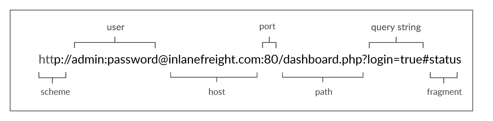
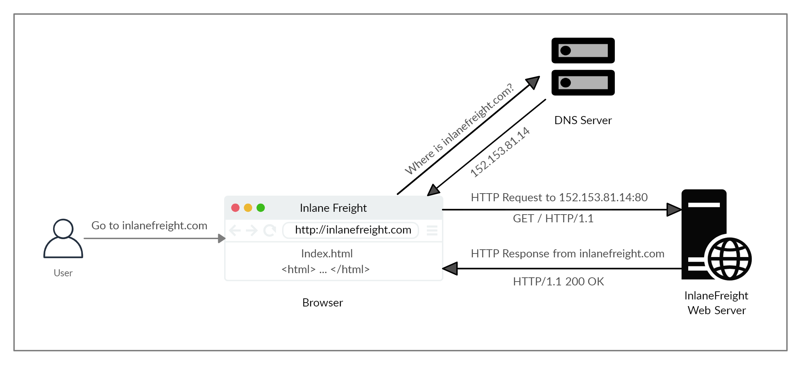
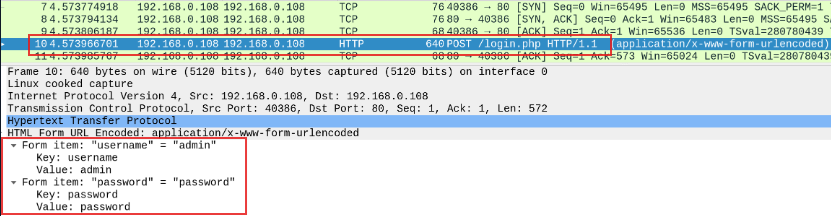
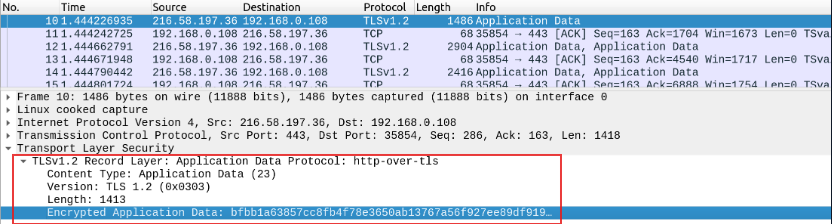
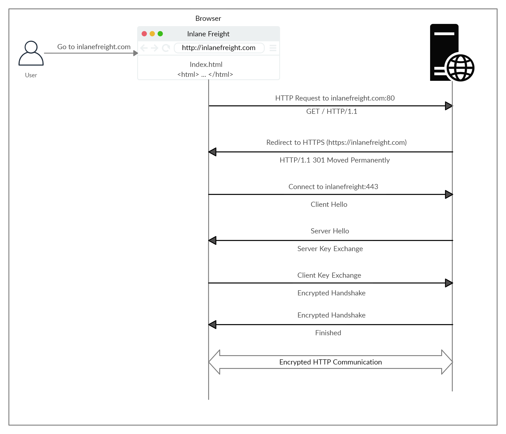
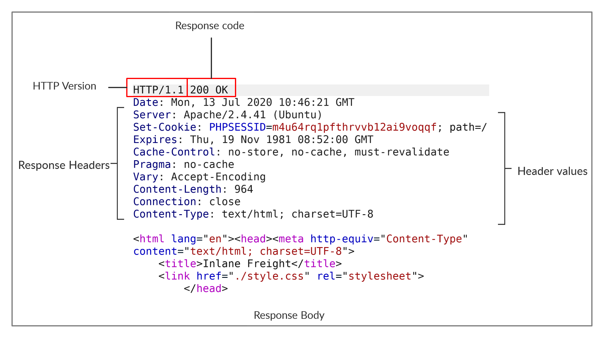

# HTTP (HyperText Transfer Protocol)

This is Repository consists my learning for HTTP from HTB

---

# Table of Contents

- [Basics](#basics-)
- [HTTPS](#https)
- [cURL](#curl)
- [HTTP Request & Response :](#http-request--response-)
- [Browser Devtools](#browser-devtools-)
- [HTTP Headers :-](#http-headers--)

---

# Basics 

- HTTP is a web protocol used to interact with the internet with both mobile and web applications 
- http is an application-level protocol used to access world wide web resources 
- http communication consists of client and server where client requests server for resources
- hypertext stands for text containing links to other resources and text that readers can interpret easily
- default port for http is port 80 but can be changed depending on web server configuration

---

## URL

Resources over http are accessed via url 



1. scheme is for http,https,ftp etc
2. user infor admin:password are optional components that's used for authentication to the host and is separated by @ 
3. host is the resource location it maybe hostname or ip address
4. port is separated by colon `:` and 80 is used as default for http and 443 for https
5. path is the resource we want to access can be a folder or file , if no path given default index is returned i.e index.html
6. query string is used for searching or filtering wehere it has a parameter `login` and value `true` multiple parametres can be separated by an ampersand (&)
7. fragments are processed on client side to locate sections on a page 

not all components are required to access a resource only mandatory fields like scheme , host are required

---

## HTTP Flow 



- first time user enters a url it sends a request to DNS to get the domains ip 
- once browser gets the ip address it sends GET request to default HTTP port for root path `/` 
- then web server receives the request and preocesses it ,by default the return index file when `/` is requested
- here `index.html` is read and returned by web serves as an HTTP response , response also contains status code `200 Ok` which indicates success
- the web browser renders the index.html and shows it to the user

# HTTPS 

- HTTP had a significant drawback all data atransferred through it was in clear text means anyone between source and destination could view the data
- to counter this HTTPS (HTTP Secure) protocol was created which used encryption in transferring messages
- so even if someone was in middle of they wouldnt not be able to extract the data or understand the data


> This shows the HTTP request which shows the login data in plain text and anyone on same network and capture and see the data


> in HTTPS if someone intercepts and analyzes traffic they would see encrypted text in a single stream and they would not be able to access the data

> the data transferred maybe encrupted but if a website is visited using a clear-text DNS server so it is recommended to utilize encrypted DNS Servers like 1.1.1.1 or 8.8.8.8 or use a VPN service to ensure traffic is encrypted

## HTTPS Flow



- if we type http:// instead of https:// to visit a website that uses HTTPS browser resolves domain and redirects user to webserver hosting the target website
- request is sent to port `80` first which is unencrypted the server then redirects the client to secure HTTPS port `443` instead this is done via `301 Moved permanents ` response code 
- next the client (web browser) sends a 'client hello' packet giving its info to server and server replies with 'server hello' 
- then the exchange ssl certificates which is called key exchange
- the client verifies the server's certs first then send its cert
- now encrypted handshake is intiated which confirms whether transcription and transferring is working correctly or not
- after handshake is completed normal HTTP communication is continued

---

# cURL

- cURL is a command-line tool it supports HTTP and other protocols 
- it is used in scripts and automation for sending various types of web requests from command line
- we can send basic http request using cURL and get the browser code without rendering unlike browser
```
curl http://info.cern.ch/
```
- we can download the page using `-O` flag or we can use `-o /path` to download the page to a given path
- we can use `-s` flag to use it silents without printing anything
- we can use -h to see what other options it has
```
mmar5@htb[/htb]$ curl -h

Usage: curl [options...] <url>
 -d, --data <data>   HTTP POST data
 -h, --help <category> Get help for commands
 -i, --include       Include protocol response headers in the output
 -o, --output <file> Write to file instead of stdout
 -O, --remote-name   Write output to a file named as the remote file
 -s, --silent        Silent mode
 -u, --user <user:password> Server user and password
 -A, --user-agent <name> Send User-Agent <name> to server
 -v, --verbose       Make the operation more talkative

This is not the full help, this menu is stripped into categories.
Use "--help category" to get an overview of all categories.
Use the user manual `man curl` or the "--help all" flag for all options.
```

---

# HTTP Request & Response :

- HTTP communications happen using http requests and responses mainly
- http requests are sent by the client(browser/curl) and proccessed by web servers
- the request contains all the data we require from the server
- the server processes the request and replies with HTTP response with the data required by the client

## HTTP Request :

This is an example HTTP request to https://inlanefreight.com/users/login.html


- first line of http requests contains 3 main fields


| field   | Example           | Description                                             |
| ------- | ----------------- | ------------------------------------------------------- |
| Method  | Get               | http method which tells what method to perform     |
| Path    | /users/login.html | path to the resource query can be also added at the end |
| Version | HTTP/1.1          | http version                                            |

- the next set of lines are HTTP header value pairs like `host` `user-agent` `cookie` etc and many other headers
- headers specify various attributes of a request 
- it is then terminated with a new line so server can validate the request above it
- then requests ends with requests body and data

> HTTP Version 1.X sends requests as clear text , HTTP version 2.X uses binary text in dictionary form to send requests

## HTTP Response :

after the request the server sends a HTTP Response



- First line of http response contains http version and response code `200 ok`
- after it lists response headers similar to HTTP Request
- then a new line is used to separate headers and response body
- response body is usually `HTTP` and defined as `HTTP` but it can be `JSON` ,images , style sheets ,scripts or pdf hosted on the webserver

### cURL 2 :

we can use curl to get details of http response and request by using `-v`
```
cURL -v https://inlanefreight.com
```
> -vvv gives even more info

---

# Browser Devtools :

- browsers have some tools so developers can check their websites we can use them for pentesting too
- when we visit websites the browser sends one or many web requests and handles HTTP responses to render the final view we see in browser 
- to open devtools we can use `F12` or `Ctrl+Shift+i`
- the devtools has many tabs in which one is Network tab
- if we go on network tab and refresh the page we will se the requests sent by the browser
- we can use filter urls if the website has too many requests to find what we need
- we can see the raw or unrendered code by clicking a request and then clicking on response

---

# HTTP Headers :

- http headers pass infor between server and client
- some headers are only used in request and some in response and some are general
- headers can have one or multiple values separated by colon 

1. General Header :

$$
10nlgn+5n,21000,2lgn,50n+100lgn,log3​(3lglgn),n0.5, 70n,2n,(lg⁡n)5,n2+100n,n3,nlg⁡n70n,\quad 2^n,\quad (\lg n)^5,\quad n^2 + 100n,\quad n^3,\quad n\lg n70n,2n,(lgn)5,n2+100n,n3,nlgn
$$